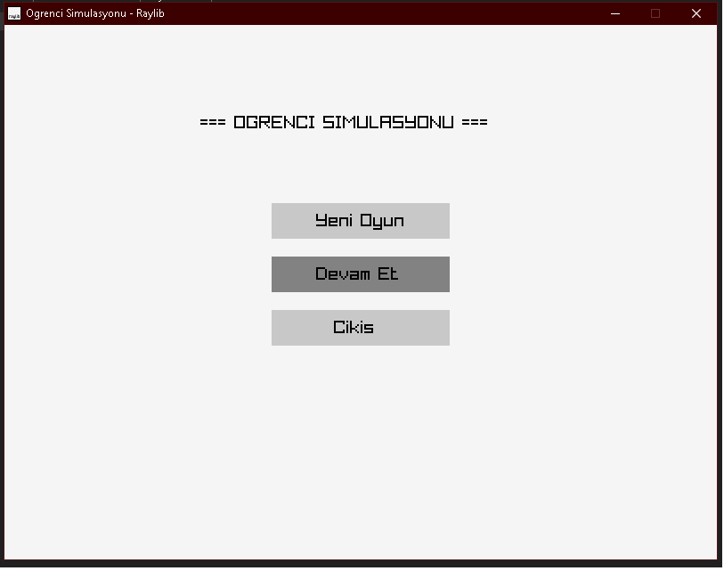
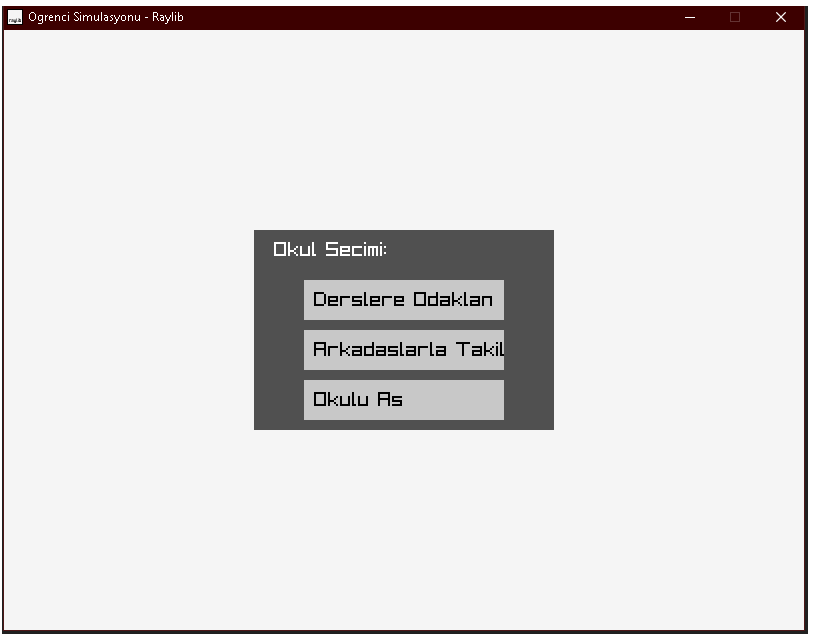
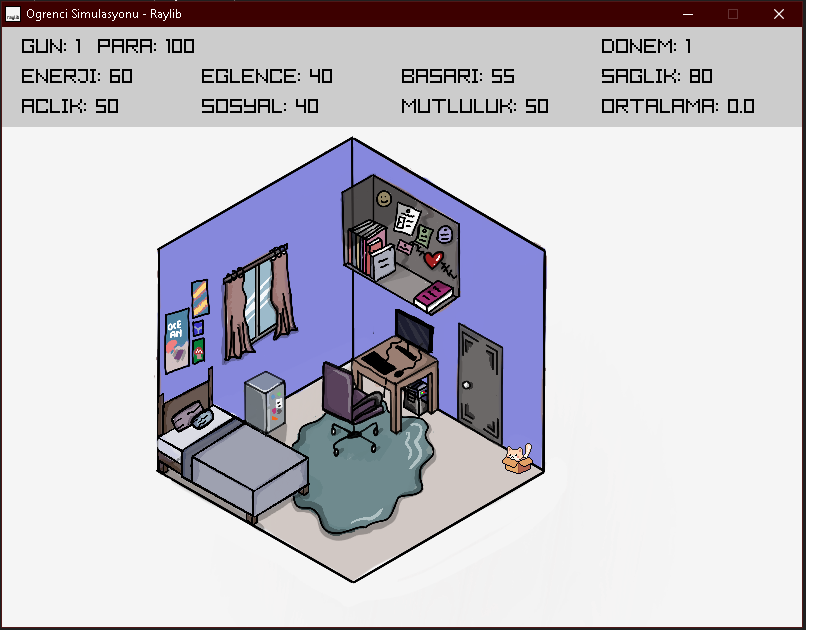
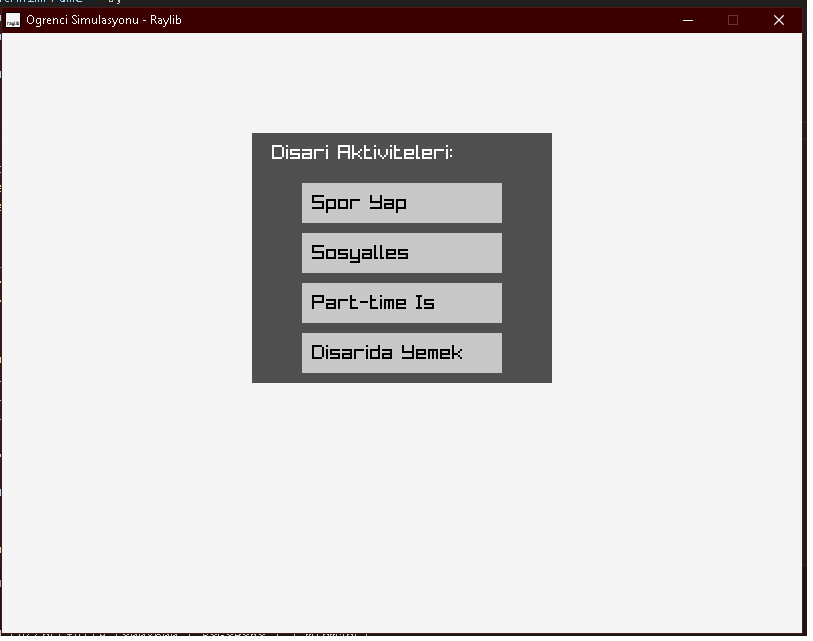
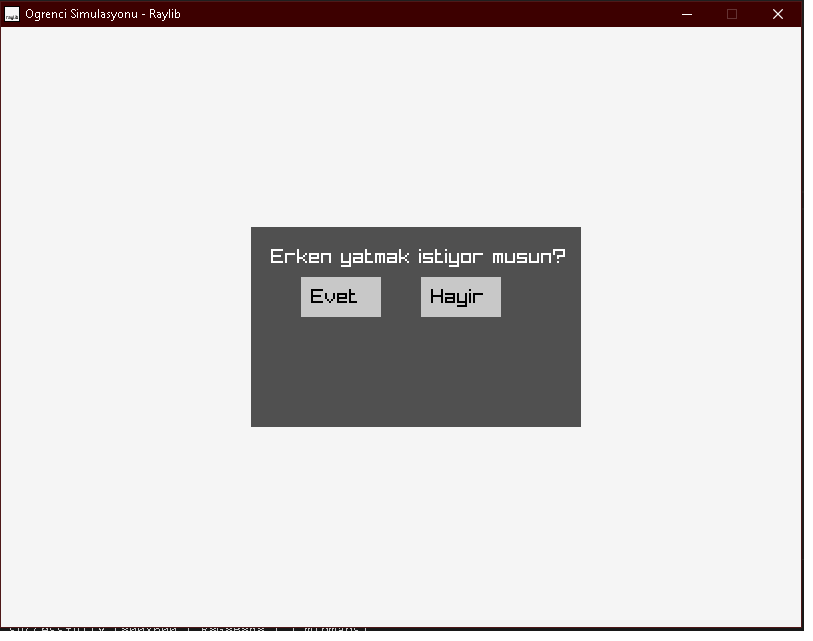
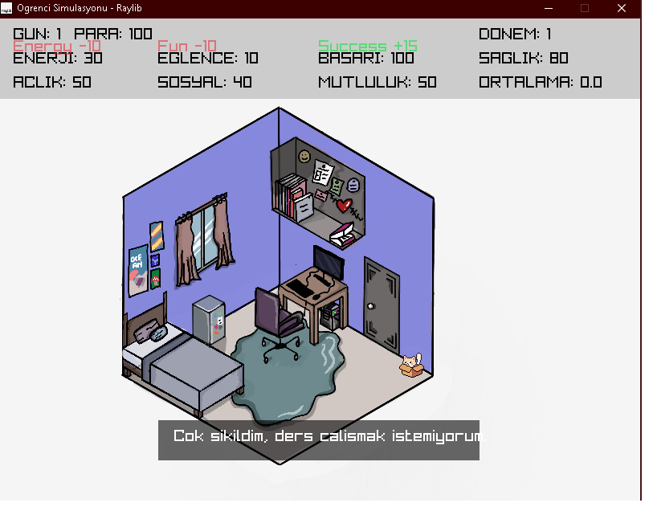
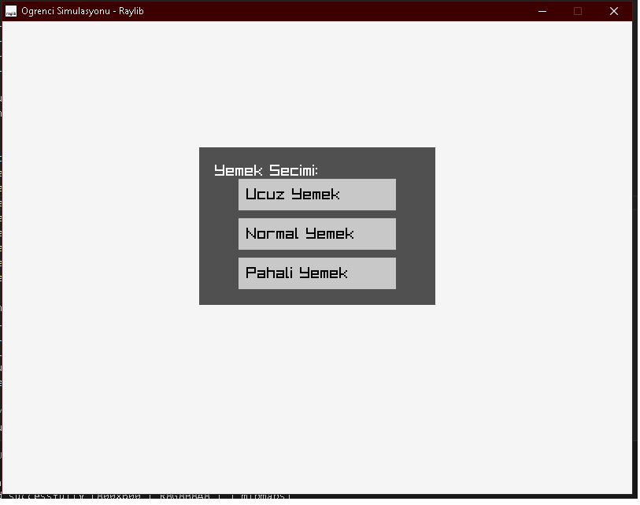
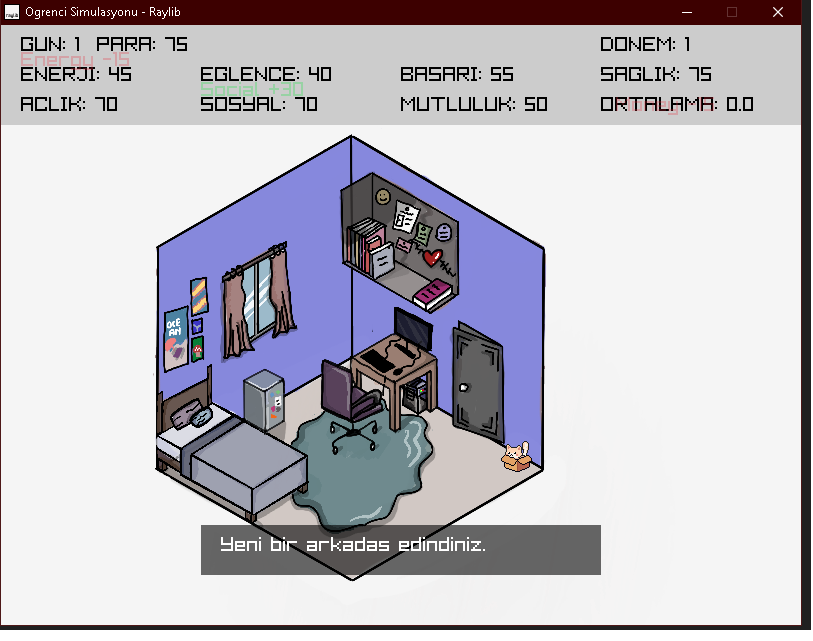
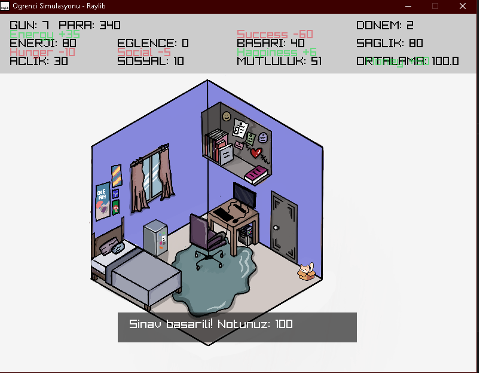

# Öğrenci Simülasyonu Oyunu 

Raylib ve C++ kullanılarak geliştirilmiş 2D bir öğrenci simülasyonu oyunudur. Oyuncu, günlük hayatında enerji, başarı, mutluluk gibi statları dengede tutarak mezun olmaya çalışır.

## Oynanış

- Ders çalış, dışarı çık, yemek ye, uyu gibi aktivitelerle statlarını yönet
- Her hafta sınav, her dönem mezuniyet şartı
- Mini oyun: Dinozor runner
- Rastgele olaylar: sosyal, sağlık, başarı etkileri

## Kullanılan Teknolojiler

- `C++`
- `Raylib`
- `OOP` yapısı (her sınıf ayrı dosyada)
- `Git` ve `GitHub` ile sürüm kontrol

## Ekran Görüntüleri

> Buraya PNG dosyaları eklenmelidir ("assets/screenshots" klasörü)

```markdown










```

## Katkıda Bulunanlar

- **Alican Tin** – Kodlama ve oyun mekaniği
- **Yelda Çoğal** – Tüm görsellerin çizimi ve sprite animasyonlar, kodlama

## 📁 Dosya Yapısı

```
/ (ana klasör)
├── main.cpp
├── PlayerStats.h / PlayerStats.cpp
├── EventManager.h / EventManager.cpp
├── InteractableObject.h / InteractableObject.cpp
├── GameEvent.h
├── ClampUtils.h
├── GameState.h
├── PlayerType.h
├── StatChangePopup.h
├── assets/
│   ├── backgrounds/
│   ├── animations/
│   ├── objects/
│   ├── screenshots/
│   └── (PNG görseller)
```

## Teslim Bilgisi

- Ders: CENG 220 Programlama Dilleri Laboratuvarı
- Teslim tarihi: 18 Mayıs 2025
- Proje linki: [GitHub Linki buraya eklenecek]
